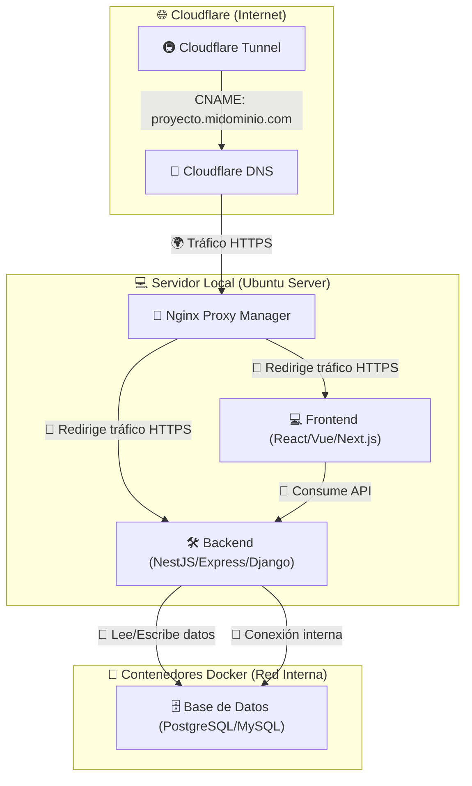

```mermaid
graph TD;
    
    %% Sección 1: Cloudflare Tunnel y DNS
    subgraph Cloudflare ["🌐 Cloudflare (Internet)"]
        CF_Tunnel["🚇 Cloudflare Tunnel"] -->|CNAME: proyecto.midominio.com| CF_DNS["📡 Cloudflare DNS"]
    end

    %% Sección 2: Servidor Local con Nginx Proxy Manager
    subgraph Servidor_Local ["💻 Servidor Local (Ubuntu Server)"]
        NPM["📌 Nginx Proxy Manager"] -->|🔀 Redirige tráfico HTTPS| Frontend
        NPM -->|🔀 Redirige tráfico HTTPS| Backend
    end

    %% Sección 3: Contenedores Docker
    subgraph Contenedores_Docker ["🐳 Contenedores Docker (Red Interna)"]
        Frontend["💻 Frontend (React/Vue/Next.js)"] -->|📡 Consume API| Backend
        Backend["🛠️ Backend (NestJS/Express/Django)"] -->|💾 Lee/Escribe datos| DB
        DB["🗄️ Base de Datos (PostgreSQL/MySQL)"]
    end

    %% Conexiones entre componentes
    CF_DNS -->|🌍 Tráfico HTTPS| NPM
    Backend -->|🔄 Conexión interna| DB


```