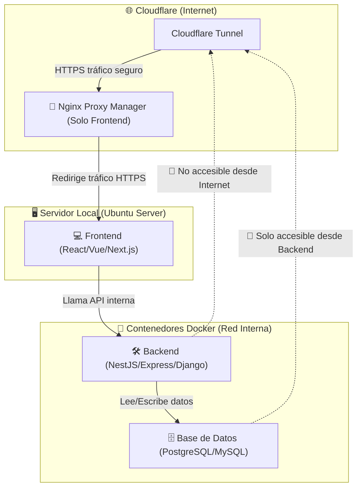

```mermaid
graph TD;
    
    %% Sección 1: Cloudflare Tunnel expone solo el frontend
    subgraph Cloudflare ["🌐 Cloudflare (Internet)"]
        CF_Tunnel["Cloudflare Tunnel"] -->|HTTPS tráfico seguro| NPM
    end

    %% Sección 2: Servidor Local con Nginx Proxy Manager
    subgraph Servidor_Local ["🖥️ Servidor Local (Ubuntu Server)"]
        NPM["📌 Nginx Proxy Manager (Solo Frontend)"] -->|Redirige tráfico HTTPS| Frontend
    end

    %% Sección 3: Contenedores Docker en Red Interna
    subgraph Contenedores_Docker ["🐳 Contenedores Docker (Red Interna)"]
        Frontend["💻 Frontend (React/Vue/Next.js)"]
        Backend["🛠️ Backend (NestJS/Express/Django)"]
        DB["🗄️ Base de Datos (PostgreSQL/MySQL)"]

        %% Conexiones dentro de la red interna
        Frontend -->|Llama API interna| Backend
        Backend -->|Lee/Escribe datos| DB
    end

    %% Sección 4: Seguridad
    Backend -. 🚫 No accesible desde Internet .-> CF_Tunnel
    DB -. 🚫 Solo accesible desde Backend .-> CF_Tunnel


```