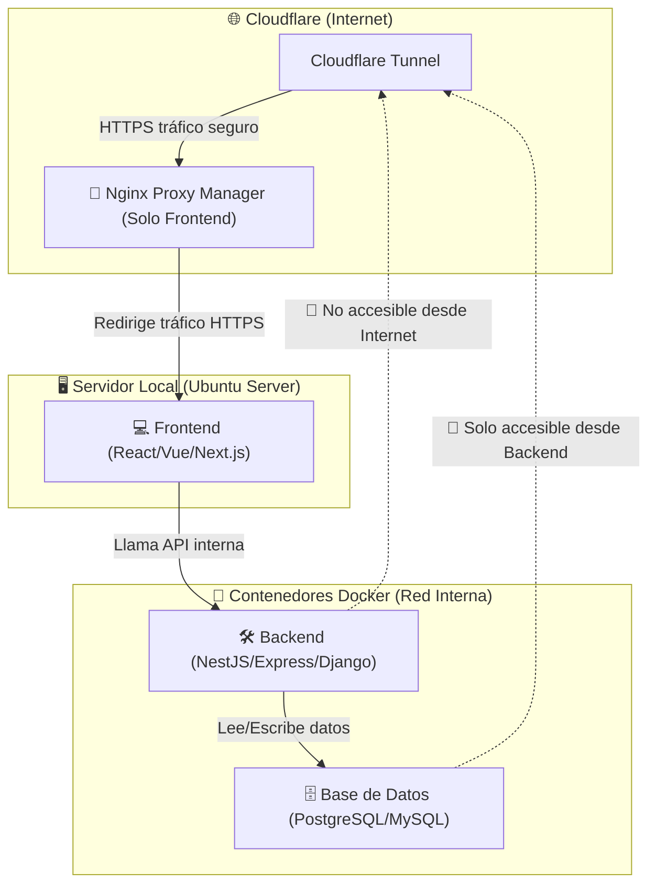

# 📘 Exposición de Múltiples Proyectos con Cloudflare Tunnel y Nginx Proxy Manager

## 📌 Introducción
Este documento describe cómo exponer múltiples proyectos dockerizados en un servidor local utilizando **Cloudflare Tunnel** y **Nginx Proxy Manager (NPM)**.

### 🌟 Beneficios:
✅ No necesitas abrir puertos en el router.
✅ Seguridad mejorada con Cloudflare y SSL gratuito.
✅ Fácil administración de múltiples proyectos con NPM.

---

## 🚀 Arquitectura del Sistema



📌 **Explicación:**
1. Los usuarios acceden a `proyecto1.midominio.com`, `proyecto2.midominio.com`, etc.
2. Cloudflare redirige el tráfico al **túnel**.
3. El túnel lo envía a **Nginx Proxy Manager** en el servidor local.
4. **NPM** reenvía el tráfico al proyecto correspondiente según el subdominio.

---

## 🛠️ Instalación

### **1️⃣ Crear un túnel en Cloudflare**
1. Ve a [Cloudflare Dashboard](https://dash.cloudflare.com).
2. Selecciona tu dominio y accede a **Zero Trust > Access > Tunnels**.
3. Crea un nuevo túnel (`mi-tunel`).
4. Selecciona **Docker** como método de instalación.
5. Copia el comando que te proporciona Cloudflare.

### **2️⃣ Configurar Docker Compose**

📌 **Importante**: Clona el archivo `.env.template` y modifica el contenido con el token generado en Cloudflare.

### **3️⃣ Levantar los Contenedores**
Ejecuta el siguiente comando:
```bash
docker compose up -d
```
Verifica que estén corriendo con:
```bash
docker ps
```

### **4️⃣ Configurar Nginx Proxy Manager**
1. Accede a **http://192.168.101.100:81**.
2. Inicia sesión con:
   - Usuario: `admin@example.com`
   - Contraseña: `changeme`
3. Cambia la contraseña en la configuración inicial.

### **5️⃣ Agregar Proxy Hosts en NPM**
1. Ve a **Proxy Hosts** y haz clic en **Add Proxy Host**.
2. Configura:
   - **Domain Names**: `proyecto1.midominio.com`
   - **Forward Hostname/IP**: `192.168.101.100`
   - **Forward Port**: `8001`
   - Activa **"Websockets Support"** y **"Force SSL"**.
3. Guarda y repite para cada proyecto (`proyecto2`, `proyecto3`, etc.).

### **6️⃣ Configuración Final en Cloudflare**
1. Ve a **Cloudflare > SSL/TLS > Overview**.
2. Cambia el modo de encriptación a **Full (strict)**.

---

## 📂 Agregar un Nuevo Proyecto
### **1️⃣ Agregar un Nuevo Servicio Dockerizado**
Ejemplo de un nuevo servicio `proyecto4` en Docker:
```yaml
services:
  proyecto4:
    image: mi-imagen-proyecto4
    container_name: proyecto4
    restart: unless-stopped
    ports:
      - "8004:8004"
```
### **2️⃣ Configurar en Nginx Proxy Manager**
1. Agregar un nuevo **Proxy Host** con:
   - **Domain Name**: `proyecto4.midominio.com`
   - **Forward Hostname/IP**: `192.168.101.100`
   - **Forward Port**: `8004`
   - Habilitar SSL y WebSockets.

Listo, `proyecto4.midominio.com` estará accesible. 🚀

---

## 🎯 Conclusión
Con esta configuración puedes exponer múltiples proyectos en un servidor local de manera **segura y sin abrir puertos en el router**.

🚀 **¡Ahora tienes una infraestructura escalable con Cloudflare y Nginx Proxy Manager!** 🔥

